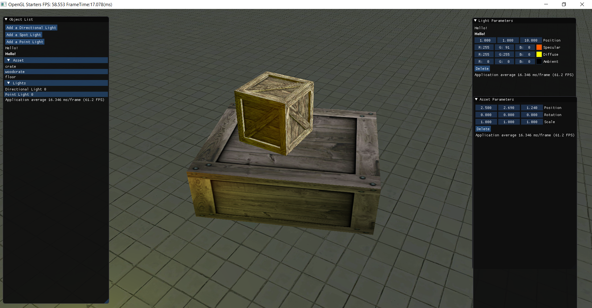
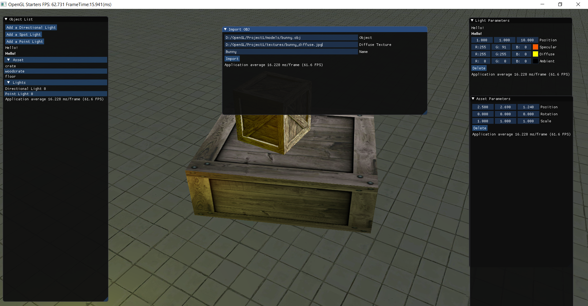
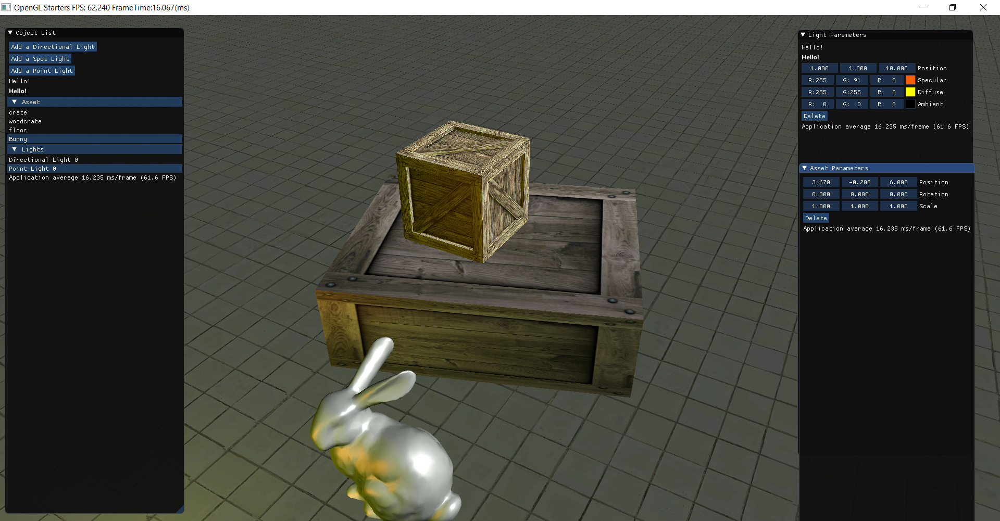

# OpenGL-Renderer
A lighting and rendering aplication to import OBJ's with diffuse textures and set up different spot lights, directional lights and point lights to setup 3D scenes. This is a 
personal project based on OpenGL.

# Demo
https://github.com/user-attachments/assets/3f71f99c-c34b-4e1d-85e9-d60e1737b455

# How to use

1)The object list toolbox lists all the assets and lights in the scene.

2)It also contains buttons to add a particular type of light(directional,point or spot).

3)To move in the viewport, use middle mouse scroll for zooming, middle mouse button to orbit and right mouse button to pan.

4)Selecting any asset or light will give you multiple options related to that which can be manipulated by using the scroll or putting in the values directly.(It also contains an option to delete a particular asset or light). 

5)To import a asset, click 'I' key on the keyboard to open the import toolbox. Put the location of the asset and texture along with a name for the asset.

 

6)Click 'S' on the keyboard to save a render of the current view.

