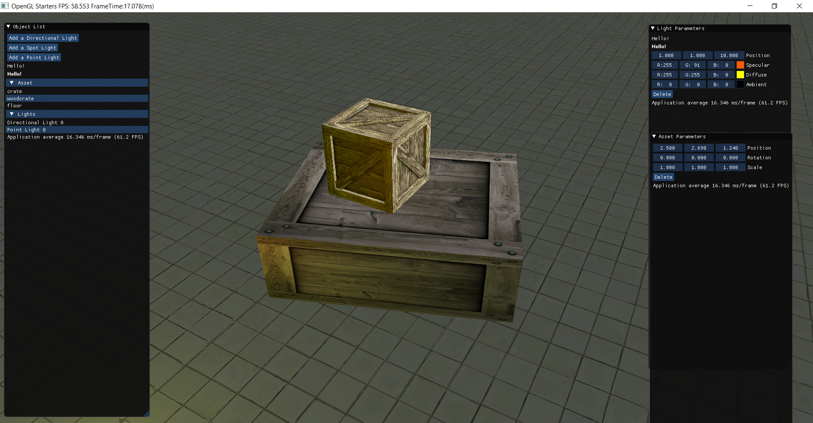
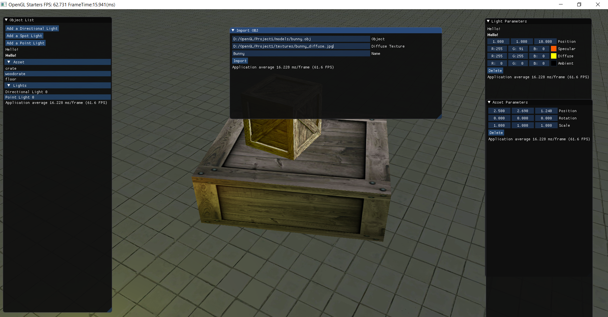
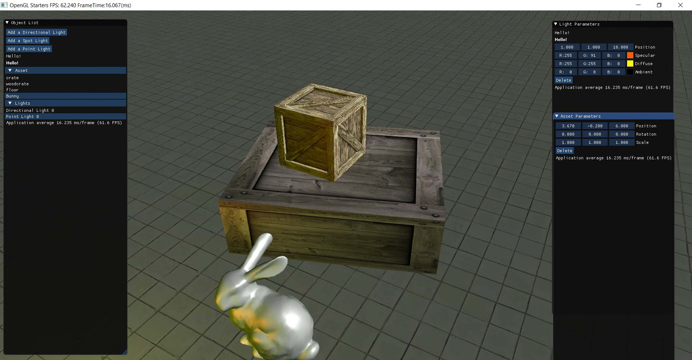

# 🎨 OpenGL-Renderer

A high-performance 3D lighting and rendering application built with C++ and OpenGL. This tool allows users to import OBJ models with diffuse textures and set up complex 3D scenes with multiple light types, including directional, point, and spot lights.

---

## 🚀 Features

-   **Multi-Light Scene Support**: Add and configure Directional, Point, and Spot lights dynamically.
-   **OBJ Asset Import**: Effortlessly import custom 3D models with associated textures.
-   **Interactive Viewport**: 
    -   **Orbit**: Middle Mouse Button
    -   **Zoom**: Scroll Wheel
    -   **Pan**: Right Mouse Button
-   **Scene Management**: Dedicated toolbox to manage all assets and lights in the scene.
-   **Real-time Manipulation**: Modify asset transformations and lighting properties on the fly.
-   **High-Quality Renders**: Save your current viewport as a PNG with a single keystroke.

---

## 🛠️ Tech Stack

-   **Language**: C++
-   **Graphics API**: OpenGL 3.3 (Core Profile)
-   **Windowing & Input**: GLFW
-   **Extension Loading**: GLEW
-   **Mathematics**: GLM (OpenGL Mathematics)
-   **UI Framework**: Dear ImGui
-   **Image Export**: stb_image_write

---

## 🏁 Getting Started

### Prerequisites
-   **Visual Studio 2019/2022**
-   **C++ Desktop Development Workload**

### Building the Project
1.  Open `Project1.sln` in Visual Studio.
2.  Ensure the configuration is set to `Debug` or `Release` and the platform is `x64`.
3.  Build and Run (**F5**).

---

## 📖 How to Use

### 1. Scene Management
The **Object List Toolbox** lists all assets and lights currently in the scene. Use it to select objects and reveal their individual properties.

### 2. Adding Lights
Quickly populate your scene by clicking the light type buttons in the main interface. You can adjust intensity, color, and range for each light source.

### 3. Importing Assets
Press **`I`** to open the Import Toolbox. Provide the paths for:
-   `.obj` file
-   Texture image
-   Custom name for the asset

### 4. Direct Component Editing
Selecting an asset or light provides granular control over its properties. Values can be adjusted via sliders (scrolling) or direct input. This also includes an option to **delete** the selected entity.

### 5. Capturing Renders
Press **`S`** to capture a high-quality render of your current viewport. The UI is automatically hidden for a clean capture.

---

## ⌨️ Controls Summary

| Key/Mouse | Action |
| :--- | :--- |
| **Middle Mouse (Scroll)** | Zoom In/Out |
| **Middle Mouse (Hold)** | Orbit Camera |
| **Right Mouse (Hold)** | Pan Camera |
| **`I` Key** | Open Import Menu |
| **`S` Key** | Save Render (Image) |
| **`F` Key** | Toggle Wireframe Mode |
| **`Esc`**| Exit Application |

---

*Enjoy building your 3D worlds! 🌟*
